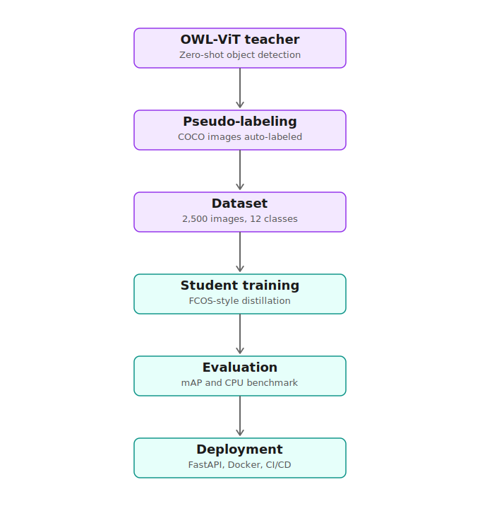

# Distill-LightOVD

**Efficient Knowledge Distillation from Open-Vocabulary Models for Real-Time Edge Detection**

A lightweight object detector trained via knowledge distillation from OWL-ViT (an open-vocabulary vision-language model) — built from scratch, achieving real-time CPU inference in a ~1.6M-parameter model.

---

## Overview

Large open-vocabulary detectors like OWL-ViT can recognize almost any object described in plain text, but they're too slow and heavy for edge deployment. This project distills that knowledge into a small, fast, purpose-built student detector — trained entirely from scratch — targeting real-time inference on CPU-only hardware (dashcams, embedded cameras, low-power devices).

**Pipeline:** OWL-ViT teacher → pseudo-labeling → dataset curation → FCOS-style student training → evaluation → FastAPI serving.

## Workflow

1. **Teacher (OWL-ViT)** — zero-shot object detection used to generate labels
2. **Pseudo-labeling** — 2,500 COCO images auto-labeled across 12 urban-scene classes
3. **Dataset** — class-rebalanced subset (person, car, bicycle, motorcycle, bus, truck, traffic light, stop sign, fire hydrant, dog, backpack, handbag)
4. **Student training** — custom ~1.6M-parameter CNN backbone + FCOS-style anchor-free detection head, trained via focal loss (classification), IoU loss (regression), and centerness loss
5. **Evaluation** — mAP, per-class AP, CPU inference benchmarking
6. **Deployment** — FastAPI inference server with a live visual dashboard, containerized with Docker



## Results

| Metric | Value |
|---|---|
| Overall mAP (IoU@0.5) | 0.40 |
| Model size | ~1.6M parameters |
| CPU inference speed | ~25.7 FPS (38.97 ms/image) |
| Training | 80 epochs, from scratch, 1,628 images |

**Per-class AP:**


**Training loss curves:**


Full results: [`results/results_map.json`](results/results_map.json)

### Notes on evaluation

- mAP was measured on the training set (no held-out validation split was used) — this is an optimistic upper bound, not a generalization measure.
- Performance is strongest on larger, visually distinct classes (dog, bus, truck) and weakest on small/occluded classes (traffic light, handbag, stop sign) — a known limitation of single-scale detection heads, consistent with detection literature.

## Live Demo

The trained model is served via a FastAPI backend with an interactive dashboard — upload an image, get live detections drawn directly on canvas.

Run locally:
```bash
docker build -t distill-lightovd .
docker run -p 8000:8000 distill-lightovd
```
Then open `http://127.0.0.1:8000/`.

## Architecture

- **Backbone:** 4-stage lightweight CNN (32→64→128→256 channels), stride 16
- **Head:** FCOS-style anchor-free detection head (classification, box regression, centerness branches)
- **Training:** knowledge distillation from OWL-ViT pseudo-labels, with class-weighted focal loss to address dataset imbalance (~115:1 person-to-stop-sign ratio in raw COCO)

## Known Limitations & Future Work

- **Box localization precision**: the current model (80 epochs) produces correct classifications but loose bounding boxes. A regression-target normalization fix (dividing box-edge targets by stride during training) was implemented and tested but not yet retrained due to GPU compute constraints — this is expected to meaningfully tighten box precision.
- **Single-scale detection**: the current head operates at one feature scale (stride 16), which limits small-object detection (traffic lights, stop signs). A multi-scale FPN-style head is a natural next step.
- **No held-out validation split**: current mAP is measured on training data; a train/val split would give a true generalization estimate.

## Tech Stack

PyTorch, Transformers (OWL-ViT), FastAPI, Docker, GitHub Actions (CI), pytest, Google Colab (training compute)

## Project Structure
src/
├── teacher/        # OWL-ViT wrapper for pseudo-labeling
├── student/         # Lightweight CNN backbone + detection head
├── distillation/     # Losses, target assignment, training loop
├── data/            # Dataset loader
├── evaluation/       # mAP metrics, prediction decoding
└── serving/         # FastAPI inference server + dashboard
## Running Tests

```bash
pip install -r requirements.txt
pytest tests/ -v -m "not slow"
```

CI runs linting (flake8), formatting checks (black), tests (pytest), and a Docker build/smoke-test on every push.
